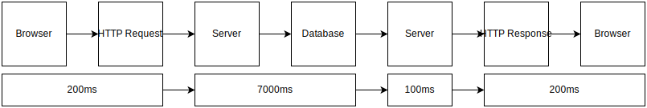
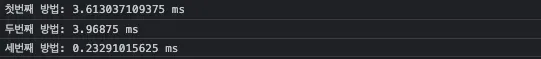
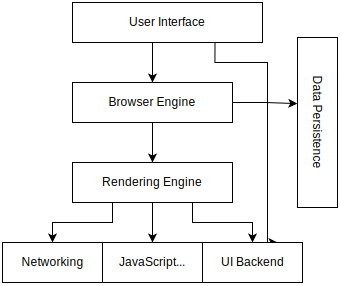
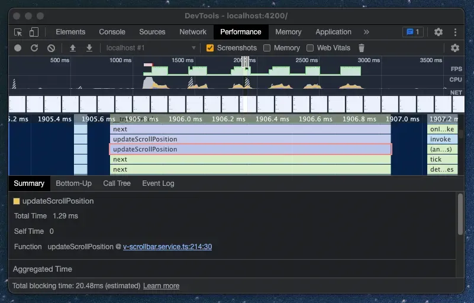
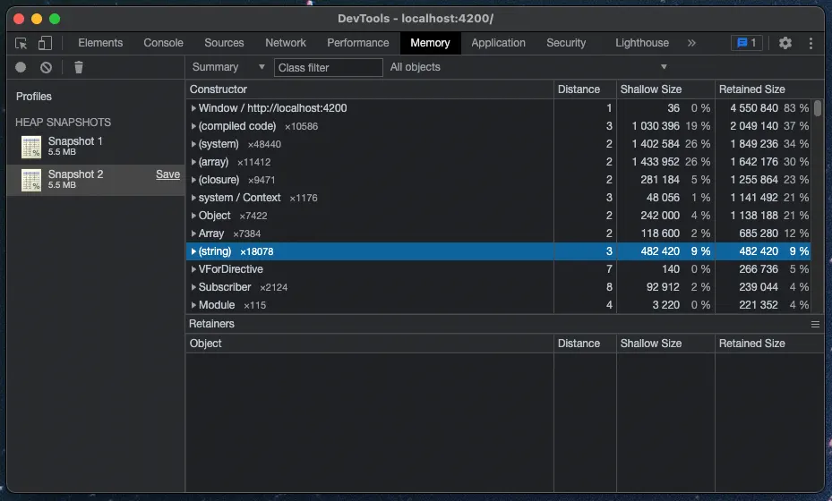
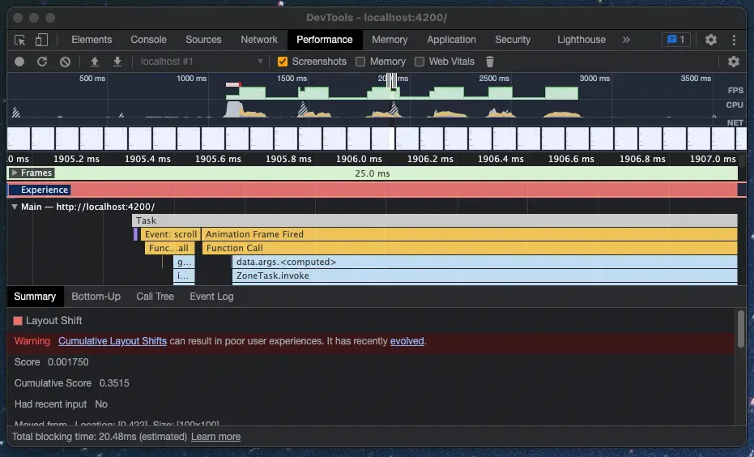

## 왜 성능을 신경써야 할까?

프론트엔드 업무를 진행하다 보면 사용자로부터 크고 작은 성능 문제를 늘 지적받게 됩니다. **“웹은 언제나 앱보다 느리다”**는 명제가 존재하는 덕분에 웹은 네이티브 앱 개발에 비해서 언제나 더 많은 최적화 작업을 필요로 하고 있습니다.

서버사이드 렌더링(SSR)을 개발할 당시는 지금보다는 문제가 자유로웠던 것으로 기억합니다. 페이지가 얼마나 무겁던, 메모리 점유율이 얼마나 올라가건, 지금 사용자가 보고있는 화면만 어찌저찌 넘어간다면 페이지는 완전히 새로고침 되므로 문제에 대해 크게 걱정하거나 급히 고칠 필요가 없었습니다.

하지만 이제는 많은 수의 웹 페이지가 클라이언트 사이드 렌더링(CSR)으로 구현되어 사용자에게 제공되고 있습니다. 그리고 이는 점차 애플리케이션(싱글 페이지 애플리케이션, SPA)으로 진화하여 브라우저에서 최초 로딩된 단 한 페이지를 가지고도 온갖 가상의 페이지와 팝업을 보여주며 셀 수 없이 많은 기능까지 사용자에게 제공하고 있습니다.

하지만 이렇게 구현된 웹 앱에서 발생한 성능 문제는 서버사이드 렌더링과는 다르게 사용자에게 크게 치명적입니다. 새로고침이 되지 않는 특성 상 앱을 사용하는 동안 전반적인 사용자 경험이 저해될 수 있기 때문입니다. 그렇기에 현재 시점의 성능 문제 해결 과제는 과거보다도 더 중요하다 생각되고 있습니다.

본문에서는 제가 프론트엔드 개발자로 여러 성능 문제를 경험하면서, 현재의 제가 생각하는 성능의 정의와 문제에 대한 접근 방법을 제시하고 있습니다. 그리고 마지막으로 성능 문제를 해결하기 위한 도구인 크롬 개발자 도구의 이점에 대해 간단히 언급하고 있습니다. 편한 마음으로 읽어만 주시면 감사드리겠습니다.

---

# 성능의 정의

> “팝업이 뜨는데 너무 오래 걸려요!”

사용자가 위와 같이 이야기한다면 성능의 의미는 모르더라도 성능이 문제라는 것을 짐작하실 겁니다. 이를 보고 개발자는 팝업을 호출하는 코드를 보며 중복되는 코드를 리팩토링하고 비효율적인 반복문을 개선한 다음, 다시 팝업을 열어 개선된 점이 있는지를 확인하게 됩니다.

하지만 개선된 점이 없습니다. `console.time` API를 사용하여 측정했을 때는 분명한 성능 향상이 보입니다. 200ms 가 걸리던 처리가 20ms 로 10분의 1 수준으로 감소했음에도, 실제 팝업을 열었을 때 체감적인 차이는 보이지 않습니다.

위 사례는 제가 처음 성능 문제를 겪었을 당시 접근했던 방법의 예시입니다. 이 방법은 여러가지 문제가 있지만 제가 한 실수 중 가장 중대한 부분은 바로 문제 원인을 오직 브라우저의 자바스크립트 코드로만 제한했다는 것 입니다.

결국 문제는 서버에서 데이터베이스로 정보를 요청하는 과정을 수정하여 해결했습니다. 즉, 애초에 자바스크립트 코드의 성능 문제는 전체 과정에서 극히 일부로써 작용했다는 것 입니다.



위 이미지는 브라우저에서 팝업에 필요한 데이터를 요청하고 다시 이를 받아서 화면에 보여주는 과정을 시간과 함께 간략하게 나타내고 있습니다. 제가 성능을 테스트하고 개선했던 부분은 이미지에서 마지막 부분인 ‘서버로부터 수신받은 데이터를 화면에서 보여주는 과정’ 단 하나 입니다.

성능의 단순한 사전적 의미는 '시간당 처리량' 입니다. 이 단어는 사용되는 분야에 따라서 그 의미가 조금씩 다르게 해석되고는 합니다. 저는 위 문제를 해결할 당시 성능의 의미를 아주 단순하게 생각하여 **‘자바스크립트 엔진에서의 시간당 처리량’**으로 받아들였고 잘못된 방법으로 문제에 접근했습니다.

이후 느꼈던 점은 프론트엔드에서는 성능이란 단어를 좀 더 넓게 생각해야 한다는 것 입니다. 위 사례에서 사용자가 팝업 호출 버튼을 누르는 순간부터의 모든 과정을 포함할 수 있는 의미여야 합니다. 그래서 저는 개인적으로 아래와 같이 성능의 의미를 정의하고 있습니다.

> **사용자 상호작용의 발생 시점부터 최종 결과를 사용자에게 보여주기까지의 시간당 처리량**

이 의미를 가지고 전체 과정에서의 성능을 바라보면 앞으로는 문제의 원인이 되는 부분을 정확히 구분할 수 있다고 생각됩니다. 저는 저 문제 이후로는 **프론트엔드에서 유의미한 성능 향상이 기대 가능한 경우에만 처리하는 것을 선호**하고 있습니다.

---

# 브라우저의 문제가 확실하다면

만약 성능을 넓게 바라본 상태에서 프론트엔드가 성능 문제의 주 원인이라고 결론지었다면, 이제부터는 자바스크립트 코드를 수정하게 됩니다. 하지만 리팩토링도 하고 반복문도 많이 줄였는데 도통 성능이 나아질 기미가 보이지 않습니다. 이를 간단히 재현한 아래의 예시를 보겠습니다.

```javascript
const originArray = new Array(5000).fill(1);
const $app = document.getElementById('app');

console.time('첫번째 방법');
var array = originArray.map((v, i) => i);
var sum = array.map((i) => i + $app.offsetHeight);
console.timeEnd('첫번째 방법');
```

위 코드에서 `console.time` API 사이의 두 줄의 코드를 개선한다고 한다면, 반복문을 효과적으로 줄일 수 있는 아래의 방법을 먼저 적용하게 될 것입니다.

```javascript
console.time('두번째 방법');
var sum = originArray.map((v, i) => i + $app.offsetHeight);
console.timeEnd('두번째 방법');
```

콘솔을 확인해 측정된 시간을 확인해 보면 시간 차이가 크지 않거나 심지어 수정한 코드가 시간이 더 오래 소요되는 경우도 발생한다는 것을 보실 수 있습니다. 이번에는 아래의 코드를 적용하고 모든 케이스의 측정 시간을 한번에 비교해 살펴보겠습니다.

```javascript
console.time('세번째 방법');
var offsetHeight = $app.offsetHeight;
var array = originArray.map((v, i) => i);
var sum = array.map((i) => i + offsetHeight);
console.timeEnd('세번째 방법');
```



결과를 보면, 반복문은 개선하지 않고 심지어 코드 한줄을 추가했음에도 기존 대비 비교할 수 없을 정도의 성능 향상이 이루어 진 것을 확인할 수 있습니다.

💡 이 테스트는 [링크](https://stackblitz.com/edit/js-vblyps?file=index.js)에서 직접 시도해 보실 수 있습니다.

이 실험에서 의문을 가질 수 있는 부분은 두가지 입니다.

- 자바스크립트의 배열은 일반적인 배열이 아니라서 반복문에 취약함에도 두번째 방법이 효과가 없다는 것

- offsetHeight 을 미리 선언만 했는데 과도한 성능 향상이 발생한 것

그리고 위 의문에 대한 답변은 아래와 같습니다.

- 현대 자바스크립트 엔진이 타입과 메모리 사이즈가 동일한 데이터만 배열에 담는 경우는 인덱스 순회 성능이 빠른 밀집 배열(Dense Array)과 같이 동작하도록 최적화 되어있기 때문

- offsetHeight 은 화면에 그려진 DOM 요소에 접근하여 측정한 높이를 가져오게 되며, 읽기 성능이 매우 떨어지는 속성

위 코드가 빠른 이유를 알고, 이해할 수 있는지의 여부는 본문에서는 중요치 않습니다. 이 사례의 핵심은 브라우저별 동작 특성과 최적화 알고리즘, 각 API 별로 성능에 대한 지식 등을 모두 암기하는 것이 꽤나 고역인 일이라는 것과, **눈에 보이는 코드의 효율성만 개선하는 것은 성능 개선 실효성이 매우 떨어지는 방법**이라는 것 입니다.



위 이미지는 흔히 볼 수 있는 브라우저의 고수준 설계의 다이어그램입니다. 현대의 브라우저는 코드 복잡성이 이미 운영체제와 비슷한 수준이라고도 합니다. 저도 그렇고 다른 분들도 이러한 브라우저의 구조와 동작 원리를 모두 외우고 이해하고 있는 개발자는 많지 않으리라 생각됩니다.

이러한 이론적 지식이 중요하지 않다 말할 수는 없겠지만, 당장 해결해야 하는 사용자의 성능 문제를 두고 깊은 지식의 늪으로 함부로 빠져들 수도 없는 노릇입니다.

그래서 위와 같은 문제들을 지식이 완전하지 않은 상태에서도 빠르게 해결할 수 있도록 **나를 대신하여 정확히 성능을 평가하고 문제 원인을 제시해 줄 수 있는 도구**가 필요하다는 것을 느끼게 됩니다.

---

# 결국 도구가 필요하다

위에서 언급한 바와 같이, 성능 문제가 발생했을 때 개발자가 코드만 보고 정확히 원인을 짚어내기란 여간 까다로운 일이 아닙니다. 관련된 검색을 통해 나오는 글들도 대부분 공통적으로 발생되는 문제만 다루고 있어 내가 겪는 문제에 해당되는 적합한 해결 사례를 찾기도 어렵습니다.

결국은 어떻게든 스스로 문제를 진단하며 해결해야 하는데, 이를 도와줄 수 있도록 시중에는 여러 가지의 성능 평가 및 진단 도구들이 많이 출시되어 있습니다. 그리고 가장 유명하면서도 무료이며 대부분의 PC 에 이미 설치되어 있는 도구가 **‘크롬 개발자 도구’** 입니다.





크롬 개발자 도구는 이미 많이 사용하시겠지만 **‘성능’**과 **‘메모리'** 탭을 사용해본 경험은 아마 적으실 겁니다. 성능 탭은 현재 사이트의 성능을 평가하여 어디에서 얼마만큼의 시간 지연이 발생했는가를 시각적으로 확인할 수 있도록 도와주며, 메모리 탭에서는 메모리에 담겨있는 정보들을 시각적으로 확인할 수 있도록 도와주고 있습니다.

이 도구를 통해 성능을 평가한 자료를 토대로 개발자는 네트워크 통신이나 특정 요소의 렌더링 등 성능 문제가 발생하는 구간을 진단할 수 있으며, 크롬 디버그 모드와 적절하게 연계하면 **내 코드의 특정 부분에서 소요된 시간까지도 정확하게 측정할 수 있습니다.**




그리고 더 좋은 부분은 크롬이 인식 가능한 문제의 경우는 링크를 통해 원인과 해결 방법까지도 먼저 제시해 준다는 것 입니다. 현재의 저는 거의 대부분의 성능 문제를 먼저 크롬 개발자 도구를 통해 평가하고, 평가된 데이터를 기반으로 문제에 객관적으로 접근하여 해결하는 방법을 가장 선호하고 있습니다.

과거에는 지식을 기반으로 문제에 대한 해결 방법을 선택해야 했지만, 이제는 데이터를 바탕으로 문제에 필요한 지식만 그때 그때 습득해나가는 방식을 사용할 수 있으니 접근 방식이 더 빠르고 효율적이라고 생각합니다. 그래서 본문이 성능에 대한 이해와 도구의 필요성에 대해 도움이 되는 글이 되었으면 하는 바램입니다.

이만 글을 마치며, 제 경험이 다른 분께도 도움이 된다면 좋겠습니다. 다음에는 실제로 개발자 도구를 통해 성능 문제를 평가하고 이를 분석해나가는 과정을 작성하겠습니다.
