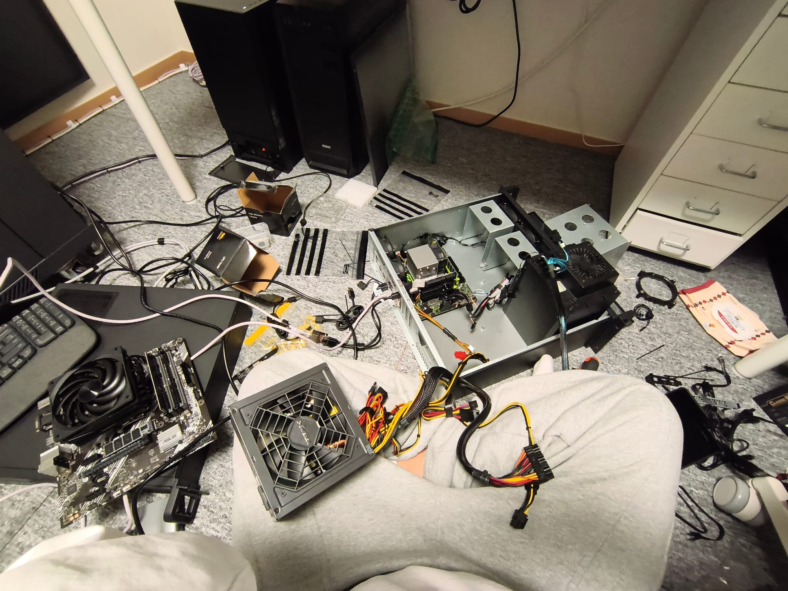
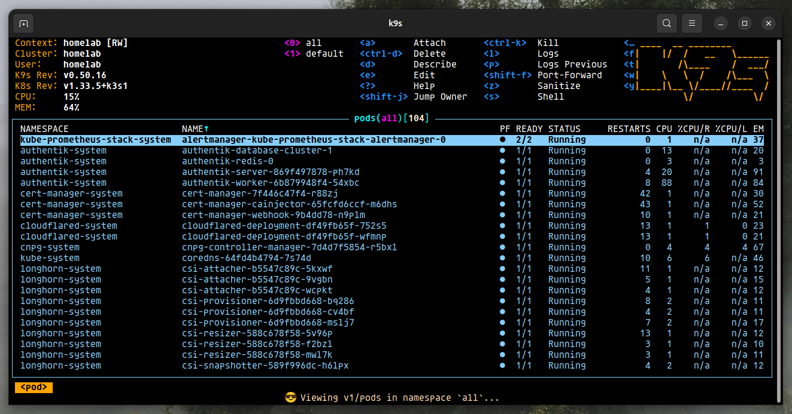
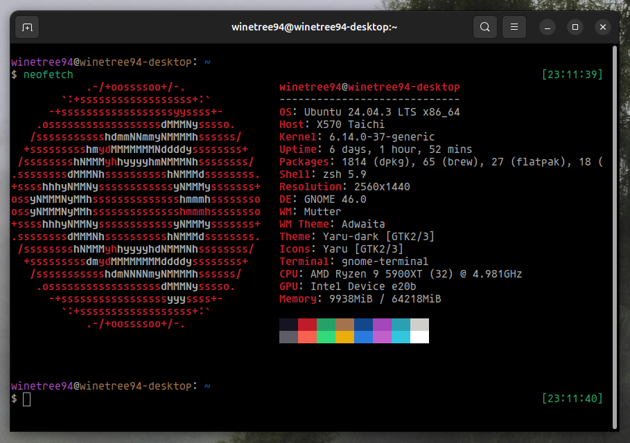
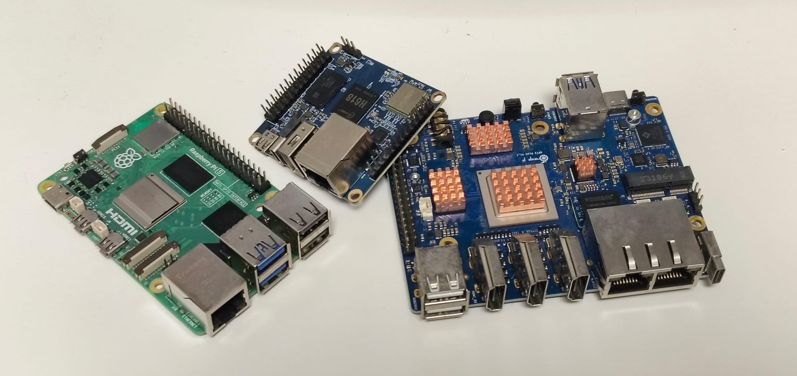
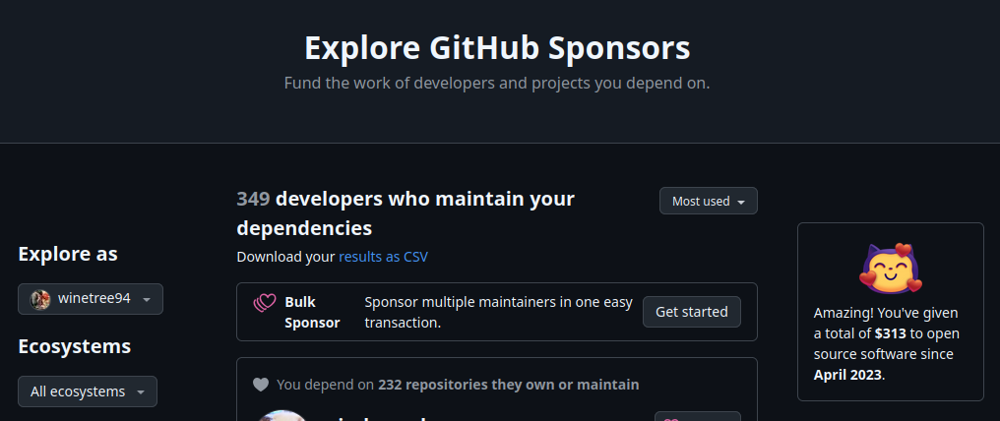

My day job is mainly front-end web development. But outside of work, I dabble in a wider range of development fields and hobbies. I'd like to introduce the areas I'm passionate about and currently learning, so you can get to know me a little better.

---

## Self hoster

The hobby I'm most deeply invested in is, without a doubt, homelabbing. I self-host essential internet services like email, notes, blog, and cloud storage right from a server in my room.

So I'm also a mini DevOps engineer of sorts. I have the (sole) responsibility of managing networking, hardware, virtual environments, and even Kubernetes—all within my home. Thanks to this setup, whenever a service goes down due to a power outage or (more often) my own mistakes, I get to experience the delightful feeling of my entire life crumbling down.

And when hardware decides to act up, it turns my room into a complete disaster zone like this.

It's a pretty odd hobby for a front-end developer, I'll admit, but surprisingly, these activities have come back to help me at work. Somehow, I've ended up being responsible for our company's internal network DevOps as well.

---

## On-premise Kubernetes

My homelab infrastructure has evolved gradually—from virtual machines (VMs) to containers, and then from standalone containers to a container orchestration environment. Currently, I'm running almost all my services on a single-node Kubernetes cluster.

Since my home isn't a public cloud environment (like AWS or GCP), I can't enjoy the benefits of managed Kubernetes. So I use an on-premises approach where I manage every component of the cluster myself. Plus, because I'm running stateful workloads directly, I'm dealing with **stateful Kubernetes**—the kind everyone tries to avoid.

That's why I'm really interested in the evolution of Kubernetes and the stateful ecosystem. I enjoy experimenting with new tools whenever they come out. Well, to be honest, I'd probably slack off if it weren't for the looming threat of my entire digital life grinding to a halt—so it's somewhat forced fun.

I know this is way more than necessary for a home setup. But hobbies always tend to go beyond necessity, right? You all know what I'm talking about, don't you? :>

---

## Linux

I'm both a Linux enthusiast and an active user. All my servers run Ubuntu Server, and I use Ubuntu Desktop on my desktop and laptop. For the desktop environment, I prefer GNOME (sorry for writing it as "Gnome").

Beyond that, I respect and appreciate all the different distros and desktop environments out there. I always try out new versions of Debian and Fedora as they're released, and I enjoy testing various desktop environments like Cinnamon, MATE, and KDE.

I live in hope that one day Linux will win the desktop OS war against Windows and Mac. It won't be easy, but thanks to Steam's Proton, I think that day might actually come.

---

## Embedded Computer

I'm also a huge fan of small, low-power embedded computers. There's something deeply satisfying about watching what these affordable, sub-10W machines can accomplish. That's why I'm always excited to follow the development of ARM and RISC-V based CPUs.

Hardware-wise, I'm a big fan of Korea's own Hardkernel products, though I also buy and experiment with boards from various manufacturers like Raspberry Pi, Orange Pi, and FriendlyElec. Aside from Raspberry Pi, this field is dominated mostly by Chinese and Taiwanese manufacturers, which is a bit disappointing in terms of diversity.

The product I'm most interested in lately is CIX's CD8180 CPU, which supports full UEFI. I'm hoping that one day these computers will have standardized boot processes, allowing us to install software as freely as we do in x86 environments.

---

## Open Source Sponsor

My homelab, Linux, and embedded computing hobbies are only possible thanks to the volunteer developers in the open-source ecosystem. That's why I try to support these developers, even if it's just with small amounts.

Modern software development can no longer be done from scratch—most new software is built by assembling open-source components like LEGO bricks. So I really hope that companies using open source will take sponsorship more seriously.

---

## tinyrack

I have a dream of building a platform where people can share and easily learn about the homelab hobby. That's why I created and have been developing TinyRack, a blog and community space.

My day job keeps me pretty busy, so I haven't been able to invest as much into it as I'd like yet. But someday, I hope to grow it into the go-to place people think of when they hear "homelab." If you're interested, I'd love for you to check it out.
