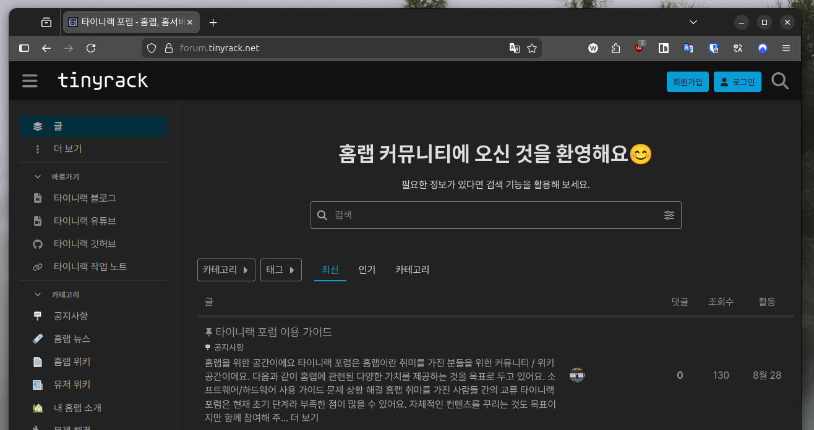

저의 회사에서의 직무는 주로 웹의 프론트엔트 개발이에요. 하지만 회사 외부에서는 좀 더 다양한 분야의 개발과 취미 활동을 이어가고 있어요. 저에 대해 좀 더 자세히 알 수 있도록 제가 좋아하고 학습하는 분야들을 소개해 드리고자 해요.

---

## 셀프 호스터

제 취미 중 가장 깊게 몸담고 있는 분야는 당연 홈랩(Homelab)이에요. 저는 이메일, 메모, 블로그, 클라우드 스토리지 등 현대인에게 중요한 인터넷 서비스들을 제 방구석 서버에서 직접 운영하고 있어요.

그래서 저는 작은 데브옵스 개발자이기도 해요. 집 안에서 네트워크, 하드웨어, 가상 환경, 그리고 쿠버네티스까지 관리하는 (저 혼자만) 막중한 임무를 가지고 있거든요. 덕분에 가끔 정전같은 천재지변이나 제 실수로 인해 서비스가 망가지면 제 삶이 무너져 내리는 기분을 겪고는 해요.

가끔 하드웨어가 말썽부리면 이렇게 집 안을 난장판으로 만들어 버리기도 하구요.

프론트엔드 개발자에게 어울리지 않는 이런 괴상한 취미를 가지고 있지만, 이런 활동들이 역으로 회사 생활에 도움이 될 때가 있더라구요. 어쩌다보니 지금은 사내에서도 내부망 데브옵스를 직접 담당하고 있어요.

---

## 온프레미스 쿠버네티스

제 홈랩의 인프라는 가상 머신(VM) 기반에서 컨테이너로, 이후 단일 컨테이너에서 컨테이너 오케스트레이션 환경으로 점차 발전시켜 왔어요. 현재는 거의 대부분의 서비스를 단일 노드 쿠버네티스 환경에서 운영하고 있어요.

제 집은 퍼블릭 클라우드(AWS, GCS 등) 환경이 아니라서 관리형 쿠버네티스의 이점을 누릴 수 없어요. 그래서 클러스터의 모든 구성 요소를 직접 관리하는 온프레미스 방식을 사용해요. 또한, 상태 저장 워크로드를 직접 실행하기 때문에 모두가 기피하는 **상태가 있는(Stateful) 쿠버네티스**에요.

그래서 저는 쿠버네티스와 상태 저장 생태계의 발전에 관심이 많고, 새로운 것들이 나오면 한번씩 실험해보는 재미를 즐기고 있어요. 사실은 그러지 않고 게을러지만 제 인터넷 삶이 마비될 수 있는 위험이 있어서 반 강제적이기도 하구요.

집 안에 이 정도까진 필요가 없다는걸 저도 알아요. 하지만 취미라는건 점점 필요보다도 과해지는 법이잖아요. 다들 그러시죠? :>

---

## 리눅스

저는 리눅스의 팬이자 적극적인 사용자이기도 해요. 저의 모든 서버에는 우분투 서버 버전을 사용하고, 데스크탑과 노트북에서는 우분투 데스크탑 버전을 사용하고 있어요. 데스크탑 환경으로는 그놈(Gnome, '그'놈이라고 적어서 미안해요.)을 선호해요.

이 뿐 아니라 저는 각양각색의 배포판과 데스크탑 환경을 모두 존중하며 좋아해요. 데비안, 페도라는 늘 새로운 버전을 직접 사용해보며, 시나몬, 마테, KDE 등 다양한 데스크탑 환경을 시험해 보는것도 즐기고 있어요.

언젠가 리눅스가 데스크탑 OS 전쟁에서 윈도우와 맥보다 우위를 점하는 날을 기대하며 살아가고 있어요. 쉽진 않겠지만 스팀의 Proton 덕분에 이 날이 올 수도 있지 않을까 싶어요.

---

## 임베디드 컴퓨터

저는 또한, 소형 저전력 임베디드 컴퓨터의 덕후이기도 해요. 저렴한 가격과 10W 미만의 저전력 컴퓨터로 해낼 수 있는 일들을 지켜보며 뿌듯함을 느끼곤 하거든요. 그래서 ARM 이나 RISC-V 기반의 CPU를 가진 컴퓨터의 발전을 늘 재미있게 지켜보고 있어요.

하드웨어로는 우리나라의 하드커널 제품을 가장 좋아하며, 라즈베리파이, 오렌지파이, FriendlyElec 등 다양한 제조사의 제품들도 구매해 사용해보고 있어요. 라즈베리파이를 제외하면 이 분야는 거의 중국/대만 제조사들이 주류를 이루고 있어서 다양성이 아쉽기도 해요.

최근 가장 눈여겨 보는 제품은 완전한 UEFI를 지원하는 CIX 사의 CD8180 CPU 에요. 언젠가 이런 컴퓨터들이 표준화된 부팅 프로세스를 갖춰 X86 환경처럼 자유롭게 소프트웨어를 설치할 수 있는 날이 오길 기대하고 있어요.

---

## 오픈소스 후원가

제 홈랩, 리눅스, 임베디드 컴퓨터 취미는 오픈소스 생태계의 자원 봉사 개발자 분들 덕분에 유지할 수 있어요. 그래서 저는 이러한 개발자들을 작은 금액으로라도 후원하려 노력하고 있어요.

현대 소프트웨어의 개발은 더 이상 처음부터 모든 것을 직접 만들 수 없으며, 대부분의 새로운 소프트웨어가 오픈소스를 레고 조각처럼 사용해 만들어지고 있어요. 그래서 오픈소스를 사용하는 기업들이 후원에 대해 좀 더 진지하게 생각하길 바라고 있어요.

---

## 타이니랙

저는 홈랩이라는 취미를 함께 나누고 쉽게 배울 수 있는 플랫폼을 구축하는 꿈을 가지고 있어요. 그래서 [타이니랙](https://tinyrack.net)이라는 블로그와 커뮤니티를 만들어 꾸며가고 있어요.

본업이 많이 바쁘다 보니 아직은 크게 투자하지 못하고 있지만 언젠가는 홈랩 하면 바로 떠오르는 공간으로 발전시키고 싶은 꿈을 가지고 있어요. 관심이 있다면 한번 방문해보시길 바래요.
